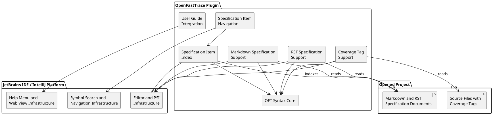

# Building Block View

This chapter describes the static decomposition of the plugin into building blocks and their responsibilities.

The following diagram drafts the MVP-level components of the plugin. It shows components, not classes.

## Component Design Items

### OFT Syntax Core
`dsn~oft-syntax-core~1`

The plugin contains a shared OpenFastTrace syntax core that recognizes valid, invalid, and incomplete specification items and coverage tags. This component provides the common parsing and recognition logic that editor support, project indexing, and navigation reuse, including extracting both sides of coverage tags so navigation can resolve shortened left-side IDs.

Covers:
- `scn~highlight-markdown-specification-item~1`
- `scn~ignore-invalid-markdown-specification-item~1`
- `scn~tolerate-incomplete-markdown-specification-item~1`
- `scn~highlight-rst-specification-item~1`
- `scn~ignore-invalid-rst-specification-item~1`
- `scn~tolerate-incomplete-rst-specification-item~1`
- `scn~highlight-coverage-tag-in-source-comment~1`
- `scn~ignore-invalid-coverage-tag-in-source-comment~1`
- `scn~tolerate-incomplete-coverage-tag-in-source-comment~1`
- `scn~show-specification-item-in-go-to-symbol~1`
- `scn~open-specification-item-from-go-to-symbol~1`
- `scn~open-specification-item-from-search-everywhere~1`
- `scn~open-specification-item-from-coverage-tag-left-side~1`
- `scn~open-specification-item-from-coverage-tag-right-side~1`

Needs: impl

### Markdown Specification Support
`dsn~markdown-specification-support~1`

The plugin provides a Markdown-specific component that connects the shared OpenFastTrace syntax recognition to the IntelliJ editor and highlighting infrastructure for `.md` and `.markdown` specification documents.

Covers:
- `scn~highlight-markdown-specification-item~1`
- `scn~ignore-invalid-markdown-specification-item~1`
- `scn~tolerate-incomplete-markdown-specification-item~1`

Needs: impl

### RST Specification Support
`dsn~rst-specification-support~1`

The plugin provides an RST-specific component that connects the shared OpenFastTrace syntax recognition to the IntelliJ editor and highlighting infrastructure for `.rst` specification documents.

Covers:
- `scn~highlight-rst-specification-item~1`
- `scn~ignore-invalid-rst-specification-item~1`
- `scn~tolerate-incomplete-rst-specification-item~1`

Needs: impl

### Coverage Tag Support
`dsn~coverage-tag-support~1`

The plugin provides a coverage-tag component that connects the shared OpenFastTrace syntax recognition to the IntelliJ editor and highlighting infrastructure for supported source, configuration, and markup files that contain OFT coverage tags in comments.

Covers:
- `scn~highlight-coverage-tag-in-source-comment~1`
- `scn~ignore-invalid-coverage-tag-in-source-comment~1`
- `scn~tolerate-incomplete-coverage-tag-in-source-comment~1`

Needs: impl

### Specification Item Index
`dsn~specification-item-index~1`

The plugin builds a project-local index of OpenFastTrace specification items from supported specification documents. This component provides the project-wide lookup data needed by symbol-based navigation and editor-driven Go To resolution.

Covers:
- `scn~show-specification-item-in-go-to-symbol~1`
- `scn~open-specification-item-from-go-to-symbol~1`
- `scn~open-specification-item-from-search-everywhere~1`
- `scn~open-specification-item-from-coverage-tag-left-side~1`
- `scn~open-specification-item-from-coverage-tag-right-side~1`

Needs: impl

### Specification Item Navigation
`dsn~specification-item-navigation~1`

The plugin exposes indexed OpenFastTrace specification items through the IntelliJ navigation facilities so users can find and open specification items through established IDE workflows such as Go to Symbol, Search Everywhere, and Go To on specification references and either side of coverage tags. For shortened left sides of coverage tags, the navigation component resolves the effective ID by inheriting missing name and revision parts from the covered ID on the right side.

Covers:
- `scn~show-specification-item-in-go-to-symbol~1`
- `scn~open-specification-item-from-go-to-symbol~1`
- `scn~open-specification-item-from-search-everywhere~1`
- `scn~open-specification-item-from-coverage-tag-left-side~1`
- `scn~open-specification-item-from-coverage-tag-right-side~1`

Needs: impl

### User Guide Integration
`dsn~user-guide-integration~1`

The plugin contributes an OpenFastTrace user guide action to the IDE Help menu and opens the user guide in the integrated web view.

Covers:
- `scn~show-oft-user-guide-in-help-menu~1`
- `scn~open-oft-user-guide-in-integrated-web-view~1`

Needs: impl
