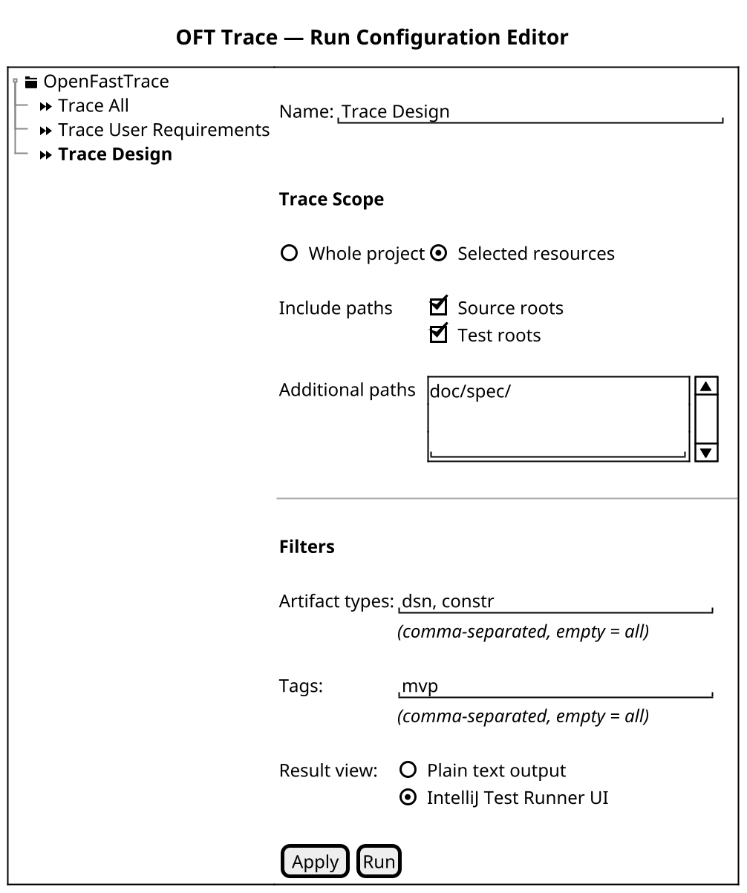

# Building Block View

This chapter describes the static decomposition of the plugin into building blocks and their responsibilities.

The following diagram drafts the current product-level components of the plugin. It shows components, not classes.

```plantuml
@startuml
skinparam componentStyle rectangle

package "JetBrains IDE / IntelliJ Platform" {
  component "Editor and PSI\nInfrastructure" as IdeEditor
  component "Symbol Search and\nNavigation Infrastructure" as IdeNavigation
  component "Live Template\nInfrastructure" as IdeLiveTemplates
  component "Action System" as IdeActions
  component "Background Task and\nProgress Infrastructure" as IdeTasks
  component "Output View and\nRun Content Infrastructure" as IdeOutput
  component "SM Test Runner\nInfrastructure" as IdeTestRunner
  component "Help Menu and\nWeb View Infrastructure" as IdeHelp
}

package "Opened Project" {
  artifact "Project Content Root" as ProjectRoot
  artifact "Markdown and RST\nSpecification Documents" as ProjectSpecs
  artifact "Source Files with\nCoverage Tags" as ProjectSources
}

package "OpenFastTrace Library" {
  component "Trace Engine and\nText Reporter" as OftTraceLibrary
}

package "OpenFastTrace Plugin" {
  component "OFT Syntax Core" as OftSyntax
  component "Markdown Specification\nSupport" as MarkdownSupport
  component "RST Specification\nSupport" as RstSupport
  component "Coverage Tag\nSupport" as CoverageSupport
  component "Specification Item\nIndex" as SpecIndex
  component "Specification Item\nNavigation" as NavigationSupport
  component "Specification Item\nCompletion" as CompletionSupport
  component "Live Template\nIntegration" as LiveTemplateSupport
  component "Trace Configuration\nIntegration" as TraceConfigurationSupport
  component "Trace Action\nIntegration" as TraceActionSupport
  component "Trace Execution\nService" as TraceExecutionSupport
  component "Trace Output\nPresentation" as TraceOutputSupport
  component "Trace Test Runner\nPresentation" as TraceTestRunnerSupport
  component "User Guide\nIntegration" as UserGuideSupport
}

MarkdownSupport --> OftSyntax
RstSupport --> OftSyntax
CoverageSupport --> OftSyntax
SpecIndex --> OftSyntax
NavigationSupport --> SpecIndex
TraceActionSupport --> TraceExecutionSupport
TraceExecutionSupport --> TraceOutputSupport
TraceExecutionSupport --> TraceTestRunnerSupport

MarkdownSupport --> IdeEditor
RstSupport --> IdeEditor
CoverageSupport --> IdeEditor
SpecIndex --> IdeEditor
NavigationSupport --> IdeNavigation
CompletionSupport --> SpecIndex
CompletionSupport --> IdeEditor
LiveTemplateSupport --> IdeLiveTemplates
LiveTemplateSupport --> IdeEditor
TraceConfigurationSupport --> IdeActions
TraceActionSupport --> IdeActions
TraceExecutionSupport --> IdeTasks
TraceOutputSupport --> IdeOutput
TraceTestRunnerSupport --> IdeTestRunner
TraceTestRunnerSupport --> NavigationSupport
UserGuideSupport --> IdeHelp

TraceActionSupport --> TraceConfigurationSupport
TraceActionSupport --> ProjectRoot : reads path
TraceConfigurationSupport --> ProjectRoot : reads settings roots
TraceExecutionSupport --> ProjectRoot : traces
TraceExecutionSupport --> OftTraceLibrary
MarkdownSupport --> ProjectSpecs : reads
RstSupport --> ProjectSpecs : reads
CoverageSupport --> "1..n" ProjectSources : reads
SpecIndex --> "1..n" ProjectSpecs : indexes
@enduml
```

## Component Design Items

### OFT Syntax Core
`dsn~oft-syntax-core~1`

The plugin contains a shared OpenFastTrace syntax core that recognizes valid, invalid, and incomplete specification items and coverage tags. This component provides the common parsing and recognition logic that editor support, project indexing, and navigation reuse, including extracting both sides of coverage tags so navigation can resolve shortened left-side IDs.

Covers:
- `scn~highlight-markdown-specification-item~1`
- `scn~ignore-invalid-markdown-specification-item~1`
- `scn~tolerate-incomplete-markdown-specification-item~1`
- `scn~highlight-rst-specification-item~1`
- `scn~ignore-invalid-rst-specification-item~1`
- `scn~tolerate-incomplete-rst-specification-item~1`
- `scn~highlight-coverage-tag-in-source-comment~1`
- `scn~ignore-invalid-coverage-tag-in-source-comment~1`
- `scn~tolerate-incomplete-coverage-tag-in-source-comment~1`
- `scn~show-specification-item-in-go-to-symbol~1`
- `scn~open-specification-item-from-go-to-symbol~1`
- `scn~open-specification-item-from-search-everywhere~1`
- `scn~open-specification-item-from-coverage-tag-left-side~1`
- `scn~open-specification-item-from-coverage-tag-right-side~1`

Needs: impl

### Markdown Specification Support
`dsn~markdown-specification-support~1`

The plugin provides a Markdown-specific component that connects the shared OpenFastTrace syntax recognition to the IntelliJ editor and highlighting infrastructure for `.md` and `.markdown` specification documents.

Covers:
- `scn~highlight-markdown-specification-item~1`
- `scn~ignore-invalid-markdown-specification-item~1`
- `scn~tolerate-incomplete-markdown-specification-item~1`

Needs: impl

### RST Specification Support
`dsn~rst-specification-support~1`

The plugin provides an RST-specific component that connects the shared OpenFastTrace syntax recognition to the IntelliJ editor and highlighting infrastructure for `.rst` specification documents.

Covers:
- `scn~highlight-rst-specification-item~1`
- `scn~ignore-invalid-rst-specification-item~1`
- `scn~tolerate-incomplete-rst-specification-item~1`

Needs: impl

### Coverage Tag Support
`dsn~coverage-tag-support~1`

The plugin provides a coverage-tag component that connects the shared OpenFastTrace syntax recognition to the IntelliJ editor and highlighting infrastructure for supported source, configuration, and markup files that contain OFT coverage tags in comments.

Covers:
- `scn~highlight-coverage-tag-in-source-comment~1`
- `scn~ignore-invalid-coverage-tag-in-source-comment~1`
- `scn~tolerate-incomplete-coverage-tag-in-source-comment~1`

Needs: impl

### Specification Item Index
`dsn~specification-item-index~1`

The plugin builds a project-local index of OpenFastTrace specification item declarations from supported specification documents. The index uses the full OFT item ID as the canonical key and stores declaration locations for symbol search and declaration navigation. Coverage occurrences under `Covers:` and in source-code coverage tags are tracked separately as references to those declarations.

Covers:
- `scn~show-specification-item-in-go-to-symbol~1`
- `scn~open-specification-item-from-go-to-symbol~1`
- `scn~open-specification-item-from-search-everywhere~1`
- `scn~open-specification-item-from-coverage-definition~1`
- `scn~stay-on-specification-item-declaration-on-go-to-declaration~1`
- `scn~show-covering-occurrences-from-specification-item-declaration~1`
- `scn~open-specification-item-from-coverage-tag-left-side~1`
- `scn~open-specification-item-from-coverage-tag-right-side~1`

Needs: impl

### Specification Item Navigation
`dsn~specification-item-navigation~1`

The plugin exposes indexed OpenFastTrace specification item declarations through the IntelliJ navigation facilities so users can find declarations through `Go to Symbol` and the Symbols tab in `Search Everywhere`, invoke `Go To Declaration` from `Covers:` entries and from either side of coverage tags, and invoke `Go To Implementations` on a declaration to see coverage-providing occurrences. For shortened left sides of coverage tags, the navigation component resolves the effective covering item ID by inheriting missing name and revision parts from the covered ID on the right side before opening the corresponding declaration.

Covers:
- `scn~show-specification-item-in-go-to-symbol~1`
- `scn~open-specification-item-from-go-to-symbol~1`
- `scn~open-specification-item-from-search-everywhere~1`
- `scn~open-specification-item-from-coverage-definition~1`
- `scn~stay-on-specification-item-declaration-on-go-to-declaration~1`
- `scn~show-covering-occurrences-from-specification-item-declaration~1`
- `scn~open-specification-item-from-coverage-tag-left-side~1`
- `scn~open-specification-item-from-coverage-tag-right-side~1`

Needs: impl

### Specification Item Completion
`dsn~specification-item-completion~1`

The plugin provides a specification-item completion component that activates IntelliJ basic completion for supported OFT reference authoring contexts, reads declared specification item IDs from the project-local declaration index, and presents those IDs in a deterministic order based on full-ID prefix, name-prefix, name-substring, and artifact-type prefix matches. Supported contexts include OFT item references under `Covers:` in supported specification documents, completion requests started from an active live-template placeholder when the placeholder expands inside a `Covers:` entry, and the target side of likely OFT coverage tags in source-code comments for the default file extensions supported by the upstream OpenFastTrace Tag Importer after a left-hand artifact type and arrow.

Covers:
- `scn~complete-specification-item-id-in-covers-section~1`
- `scn~complete-specification-item-id-in-active-live-template-covers-field~1`
- `scn~complete-specification-item-id-in-coverage-tag-target~1`
- `scn~complete-specification-item-id-in-spaced-coverage-tag-target~1`
- `scn~complete-specification-item-id-in-incomplete-coverage-tag-target~1`
- `scn~suppress-coverage-tag-target-completion-outside-target-context~1`

Needs: impl, utest

### User Guide Integration
`dsn~user-guide-integration~1`

The plugin contributes an OpenFastTrace user guide action to the IDE Help menu and opens the user guide in the integrated web view.

Covers:
- `scn~show-oft-user-guide-in-help-menu~1`
- `scn~open-oft-user-guide-in-integrated-web-view~1`

Needs: impl

### Live Template Integration
`dsn~live-template-integration~1`

The plugin provides a live-template integration component that packages a repository-owned OpenFastTrace live-template XML resource, registers that resource with IntelliJ's default live-template extension point, and keeps the bundled template set aligned with the imported upstream OFT templates plus the plugin-local scenario template. Template variables that represent covered specification item IDs stay editable while the template is active so the specification-item completion component can serve user-invoked completion in those fields.

Covers:
- `scn~show-oft-live-templates-in-live-template-settings~1`
- `scn~insert-oft-scenario-live-template~1`
- `scn~complete-specification-item-id-in-active-live-template-covers-field~1`

Needs: impl

### Plugin Distribution Resources
`dsn~packaged-plugin-logo-assets~1`

The plugin distribution resources include JetBrains plugin logo SVG assets in the plugin main JAR under `META-INF`. The default logo resource is `META-INF/pluginIcon.svg`; if the default logo is not sufficiently visible on dark backgrounds, the distribution also includes `META-INF/pluginIcon_dark.svg`. The logo assets use a 40x40 SVG size, keep transparent padding around the visible OpenFastTrace branding, and remain recognizable at JetBrains Plugin Manager and Marketplace display sizes.

Covers:
- `scn~show-plugin-logo-in-jetbrains-plugin-surfaces~1`

Needs: bld, itest

### Trace Configuration Integration
`dsn~trace-configuration-integration~1`

The plugin provides a trace-configuration component that stores OpenFastTrace trace-scope settings per IntelliJ project and through dedicated run configurations. It exposes those settings through project configuration UI and the run configuration editor, resolves the selected-resource options and filters into a normalized OpenFastTrace input set and filter criteria, stores the run-configuration result-view selection, treats the IntelliJ Test Runner UI as the result-view default when no selection is stored, and owns the plugin resource used as the OpenFastTrace run-configuration icon.

Covers:
- `scn~test-runner-as-default-run-configuration-result-view~1`
- `scn~select-plain-text-trace-result-view~1`
- `scn~select-test-runner-trace-result-view~1`
- `scn~show-openfasttrace-icon-for-run-configurations~1`

Needs: impl, itest

### Trace Action Integration
`dsn~trace-action-integration~2`

The plugin provides a trace-action component that contributes an `OpenFastTrace` action group with a `Trace Project` action under the global `Tools` menu. This component is responsible for exposing the entry only in an opened project context and for handing the action invocation to trace-configuration resolution, trace execution, and the default IntelliJ Test Runner UI presentation.

Covers:
- `scn~show-trace-project-action-in-tools-menu~1`
- `scn~disable-trace-project-action-without-open-project~1`
- `scn~run-trace-project-in-background~1`
- `scn~show-trace-project-in-test-runner-ui-by-default~1`
- `scn~reject-trace-project-without-valid-project-path~1`

Needs: impl, itest

### Trace Execution Service
`dsn~trace-execution-service~1`

The plugin provides a trace-execution service that accepts the effective OpenFastTrace input set resolved for the current project, validates that input set before starting work, invokes the OpenFastTrace library in a background task, supports cancellation through IntelliJ progress infrastructure, and produces a trace result containing the structured OpenFastTrace `Trace`, the rendered text report, and the final success or failure status.

Because OpenFastTrace discovers importers and reporters through Java `ServiceLoader`, this service executes OFT import and report-rendering calls with the plugin class loader as the thread context class loader and restores the previous context loader afterward.

Covers:
- `scn~run-trace-project-in-background~1`
- `scn~trace-selected-project-resources~1`
- `scn~reject-trace-project-without-valid-project-path~1`
- `scn~show-successful-trace-output-in-ide-output-window~2`
- `scn~show-resolved-trace-inputs-in-trace-output-window~1`
- `scn~show-failing-trace-output-in-ide-output-window~1`

Needs: impl, itest

### Trace Output Presentation
`dsn~trace-output-presentation~1`

The plugin provides a trace-output presentation component that opens an IDE output sub-window for each trace run, assigns a clear trace-specific content title, renders both successful and failing OpenFastTrace text output through the same IDE-visible flow, and adds declaration hyperlinks for OFT specification item IDs shown in that output when the corresponding items exist in the opened project.

Covers:
- `scn~show-successful-trace-output-in-ide-output-window~2`
- `scn~show-failing-trace-output-in-ide-output-window~1`
- `scn~open-specification-item-from-trace-output-window~1`

Needs: impl, itest

### Trace Test Runner Presentation
`dsn~trace-test-runner-presentation~1`

The plugin provides a trace test-runner presentation component that maps the structured OpenFastTrace trace result to IntelliJ SM test runner nodes. It creates project-local source-file suites, sorted specification-item tests, and incoming or outgoing trace-link sub-tests; derives compact title-aware labels, Unicode direction markers, pass/fail status, status roll-up, and item/link details from the OpenFastTrace trace status; and connects source-file, item, and link node navigation to the existing OpenFastTrace trace navigation support.

Covers:
- `scn~show-trace-source-files-as-test-runner-suites~1`
- `scn~show-trace-specification-items-as-test-runner-tests~1`
- `scn~show-specification-item-title-in-test-runner-ui~2`
- `scn~show-specification-item-id-in-test-runner-details~1`
- `scn~sort-specification-items-in-test-runner-ui~1`
- `scn~show-trace-links-as-test-runner-sub-tests~1`
- `scn~show-specification-item-status-in-test-runner-ui~2`
- `scn~show-trace-link-status-in-test-runner-ui~2`
- `scn~show-trace-link-direction-in-test-runner-ui~1`
- `scn~show-unicode-trace-link-direction-in-test-runner-ui~1`
- `scn~map-specification-item-trace-status-to-test-runner-status~1`
- `scn~map-trace-link-status-to-test-runner-status~1`
- `scn~roll-up-source-file-suite-trace-status~1`
- `scn~roll-up-top-level-trace-status~1`
- `scn~show-specification-item-defect-details-in-test-runner-ui~1`
- `scn~show-trace-link-defect-details-in-test-runner-ui~1`
- `scn~show-trace-link-id-details-in-test-runner-ui~1`
- `scn~navigate-from-test-runner-specification-items~1`
- `scn~navigate-from-test-runner-trace-links~1`
- `scn~navigate-from-test-runner-source-files~1`

Needs: impl, itest

## GUI Mockups

#### Run Configuration Editor UI Mockup

