# Building Block View

This chapter describes the static decomposition of the plugin into building blocks and their responsibilities.

The following diagram drafts the current product-level components of the plugin. It shows components, not classes.

```plantuml
@startuml
skinparam componentStyle rectangle

package "JetBrains IDE / IntelliJ Platform" {
  component "Editor and PSI\nInfrastructure" as IdeEditor
  component "Symbol Search and\nNavigation Infrastructure" as IdeNavigation
  component "Action System" as IdeActions
  component "Background Task and\nProgress Infrastructure" as IdeTasks
  component "Output View and\nRun Content Infrastructure" as IdeOutput
  component "Help Menu and\nWeb View Infrastructure" as IdeHelp
}

package "Opened Project" {
  artifact "Project Content Root" as ProjectRoot
  artifact "Markdown and RST\nSpecification Documents" as ProjectSpecs
  artifact "Source Files with\nCoverage Tags" as ProjectSources
}

package "OpenFastTrace Library" {
  component "Trace Engine and\nText Reporter" as OftTraceLibrary
}

package "OpenFastTrace Plugin" {
  component "OFT Syntax Core" as OftSyntax
  component "Markdown Specification\nSupport" as MarkdownSupport
  component "RST Specification\nSupport" as RstSupport
  component "Coverage Tag\nSupport" as CoverageSupport
  component "Specification Item\nIndex" as SpecIndex
  component "Specification Item\nNavigation" as NavigationSupport
  component "Trace Configuration\nIntegration" as TraceConfigurationSupport
  component "Trace Action\nIntegration" as TraceActionSupport
  component "Trace Execution\nService" as TraceExecutionSupport
  component "Trace Output\nPresentation" as TraceOutputSupport
  component "User Guide\nIntegration" as UserGuideSupport
}

MarkdownSupport --> OftSyntax
RstSupport --> OftSyntax
CoverageSupport --> OftSyntax
SpecIndex --> OftSyntax
NavigationSupport --> SpecIndex
TraceActionSupport --> TraceExecutionSupport
TraceExecutionSupport --> TraceOutputSupport

MarkdownSupport --> IdeEditor
RstSupport --> IdeEditor
CoverageSupport --> IdeEditor
SpecIndex --> IdeEditor
NavigationSupport --> IdeNavigation
TraceConfigurationSupport --> IdeActions
TraceActionSupport --> IdeActions
TraceExecutionSupport --> IdeTasks
TraceOutputSupport --> IdeOutput
UserGuideSupport --> IdeHelp

TraceActionSupport --> TraceConfigurationSupport
TraceActionSupport --> ProjectRoot : reads path
TraceConfigurationSupport --> ProjectRoot : reads settings roots
TraceExecutionSupport --> ProjectRoot : traces
TraceExecutionSupport --> OftTraceLibrary
MarkdownSupport --> ProjectSpecs : reads
RstSupport --> ProjectSpecs : reads
CoverageSupport --> "1..n" ProjectSources : reads
SpecIndex --> "1..n" ProjectSpecs : indexes
@enduml
```

## Component Design Items

### OFT Syntax Core
`dsn~oft-syntax-core~1`

The plugin contains a shared OpenFastTrace syntax core that recognizes valid, invalid, and incomplete specification items and coverage tags. This component provides the common parsing and recognition logic that editor support, project indexing, and navigation reuse, including extracting both sides of coverage tags so navigation can resolve shortened left-side IDs.

Covers:
- `scn~highlight-markdown-specification-item~1`
- `scn~ignore-invalid-markdown-specification-item~1`
- `scn~tolerate-incomplete-markdown-specification-item~1`
- `scn~highlight-rst-specification-item~1`
- `scn~ignore-invalid-rst-specification-item~1`
- `scn~tolerate-incomplete-rst-specification-item~1`
- `scn~highlight-coverage-tag-in-source-comment~1`
- `scn~ignore-invalid-coverage-tag-in-source-comment~1`
- `scn~tolerate-incomplete-coverage-tag-in-source-comment~1`
- `scn~show-specification-item-in-go-to-symbol~1`
- `scn~open-specification-item-from-go-to-symbol~1`
- `scn~open-specification-item-from-search-everywhere~1`
- `scn~open-specification-item-from-coverage-tag-left-side~1`
- `scn~open-specification-item-from-coverage-tag-right-side~1`

Needs: impl

### Markdown Specification Support
`dsn~markdown-specification-support~1`

The plugin provides a Markdown-specific component that connects the shared OpenFastTrace syntax recognition to the IntelliJ editor and highlighting infrastructure for `.md` and `.markdown` specification documents.

Covers:
- `scn~highlight-markdown-specification-item~1`
- `scn~ignore-invalid-markdown-specification-item~1`
- `scn~tolerate-incomplete-markdown-specification-item~1`

Needs: impl

### RST Specification Support
`dsn~rst-specification-support~1`

The plugin provides an RST-specific component that connects the shared OpenFastTrace syntax recognition to the IntelliJ editor and highlighting infrastructure for `.rst` specification documents.

Covers:
- `scn~highlight-rst-specification-item~1`
- `scn~ignore-invalid-rst-specification-item~1`
- `scn~tolerate-incomplete-rst-specification-item~1`

Needs: impl

### Coverage Tag Support
`dsn~coverage-tag-support~1`

The plugin provides a coverage-tag component that connects the shared OpenFastTrace syntax recognition to the IntelliJ editor and highlighting infrastructure for supported source, configuration, and markup files that contain OFT coverage tags in comments.

Covers:
- `scn~highlight-coverage-tag-in-source-comment~1`
- `scn~ignore-invalid-coverage-tag-in-source-comment~1`
- `scn~tolerate-incomplete-coverage-tag-in-source-comment~1`

Needs: impl

### Specification Item Index
`dsn~specification-item-index~1`

The plugin builds a project-local index of OpenFastTrace specification item declarations from supported specification documents. The index uses the full OFT item ID as the canonical key and stores declaration locations for symbol search and declaration navigation. Coverage occurrences under `Covers:` and in source-code coverage tags are tracked separately as references to those declarations.

Covers:
- `scn~show-specification-item-in-go-to-symbol~1`
- `scn~open-specification-item-from-go-to-symbol~1`
- `scn~open-specification-item-from-search-everywhere~1`
- `scn~open-specification-item-from-coverage-definition~1`
- `scn~stay-on-specification-item-declaration-on-go-to-declaration~1`
- `scn~show-covering-occurrences-from-specification-item-declaration~1`
- `scn~open-specification-item-from-coverage-tag-left-side~1`
- `scn~open-specification-item-from-coverage-tag-right-side~1`

Needs: impl

### Specification Item Navigation
`dsn~specification-item-navigation~1`

The plugin exposes indexed OpenFastTrace specification item declarations through the IntelliJ navigation facilities so users can find declarations through `Go to Symbol` and the Symbols tab in `Search Everywhere`, invoke `Go To Declaration` from `Covers:` entries and from either side of coverage tags, and invoke `Go To Implementations` on a declaration to see coverage-providing occurrences. For shortened left sides of coverage tags, the navigation component resolves the effective covering item ID by inheriting missing name and revision parts from the covered ID on the right side before opening the corresponding declaration.

Covers:
- `scn~show-specification-item-in-go-to-symbol~1`
- `scn~open-specification-item-from-go-to-symbol~1`
- `scn~open-specification-item-from-search-everywhere~1`
- `scn~open-specification-item-from-coverage-definition~1`
- `scn~stay-on-specification-item-declaration-on-go-to-declaration~1`
- `scn~show-covering-occurrences-from-specification-item-declaration~1`
- `scn~open-specification-item-from-coverage-tag-left-side~1`
- `scn~open-specification-item-from-coverage-tag-right-side~1`

Needs: impl

### User Guide Integration
`dsn~user-guide-integration~1`

The plugin contributes an OpenFastTrace user guide action to the IDE Help menu and opens the user guide in the integrated web view.

Covers:
- `scn~show-oft-user-guide-in-help-menu~1`
- `scn~open-oft-user-guide-in-integrated-web-view~1`

Needs: impl

### Trace Configuration Integration
`dsn~trace-configuration-integration~1`

The plugin provides a trace-configuration component that stores OpenFastTrace trace-scope settings per IntelliJ project, exposes those settings through project configuration UI, and resolves the selected-resource options into a normalized OpenFastTrace input set assembled from IntelliJ source roots, IntelliJ test roots, and additional project-relative paths.

Covers:
- `scn~configure-trace-scope-in-project-settings~1`
- `scn~trace-selected-project-resources~1`
- `scn~include-intellij-source-directories-in-selected-resource-trace~1`
- `scn~include-intellij-test-directories-in-selected-resource-trace~1`
- `scn~add-project-relative-paths-to-selected-resource-trace~1`
- `scn~show-per-line-validation-for-additional-trace-paths~1`

Needs: impl

### Trace Action Integration
`dsn~trace-action-integration~1`

The plugin provides a trace-action component that contributes an `OpenFastTrace` action group with a `Trace Project` action under the global `Tools` menu. This component is responsible for exposing the entry only in an opened project context and for handing the action invocation to trace-configuration resolution and trace execution.

Covers:
- `scn~show-trace-project-action-in-tools-menu~1`
- `scn~disable-trace-project-action-without-open-project~1`
- `scn~run-trace-project-in-background~1`
- `scn~reject-trace-project-without-valid-project-path~1`

Needs: impl

### Trace Execution Service
`dsn~trace-execution-service~1`

The plugin provides a trace-execution service that accepts the effective OpenFastTrace input set resolved for the current project, validates that input set before starting work, invokes the OpenFastTrace library in a background task, supports cancellation through IntelliJ progress infrastructure, and captures the textual trace output together with the final success or failure status.

Because OpenFastTrace discovers importers and reporters through Java `ServiceLoader`, this service executes OFT import and report-rendering calls with the plugin class loader as the thread context class loader and restores the previous context loader afterward.

Because OpenFastTrace discovers importers and reporters through Java `ServiceLoader`, this service executes OFT import and report-rendering calls with the plugin class loader as the thread context class loader and restores the previous context loader afterward.

Covers:
- `scn~run-trace-project-in-background~1`
- `scn~trace-selected-project-resources~1`
- `scn~reject-trace-project-without-valid-project-path~1`
- `scn~show-successful-trace-output-in-ide-output-window~1`
- `scn~show-resolved-trace-inputs-in-trace-output-window~1`
- `scn~show-failing-trace-output-in-ide-output-window~1`

Needs: impl

### Trace Output Presentation
`dsn~trace-output-presentation~1`

The plugin provides a trace-output presentation component that opens an IDE output sub-window for each trace run, assigns a clear trace-specific content title, renders both successful and failing OpenFastTrace text output through the same IDE-visible flow, and adds declaration hyperlinks for OFT specification item IDs shown in that output when the corresponding items exist in the opened project.

Covers:
- `scn~show-successful-trace-output-in-ide-output-window~1`
- `scn~show-failing-trace-output-in-ide-output-window~1`
- `scn~open-specification-item-from-trace-output-window~1`

Needs: impl
