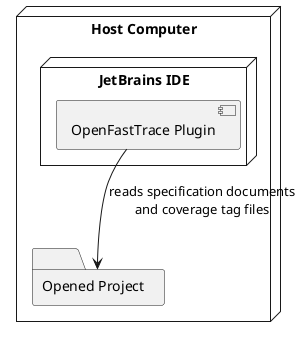

# Deployment View

This chapter describes how the plugin is packaged and deployed in its execution environment.

## Deployment Environment

The plugin is packaged as a JetBrains plugin and is installed into a JetBrains IDE on the user's host computer.

At runtime, the plugin executes inside the IDE process and accesses the currently opened project through IntelliJ Platform APIs. The MVP does not require a separate backend process, an external tracing service, or a local OpenFastTrace CLI installation.

## Runtime Nodes

The relevant deployment nodes for the MVP are:

* the host computer
* the JetBrains IDE running on that host
* the OpenFastTrace plugin loaded into that IDE
* the currently opened project that contains OpenFastTrace specification documents and coverage tags

## Deployment Diagram

## Deployment Strategy

The deployment model stays intentionally simple. All plugin logic runs locally in the host IDE, uses the IDE-provided caches and state stores, and works on files inside the active project.

Network access is not part of the normal processing path. In the MVP, network access is only used when the user opens the OpenFastTrace user guide from GitHub.
