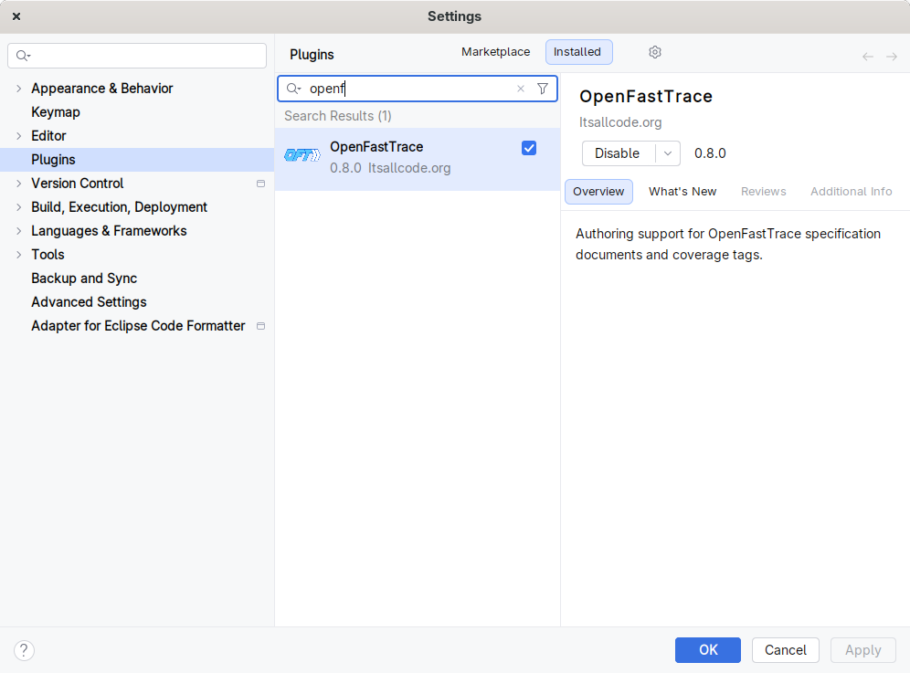
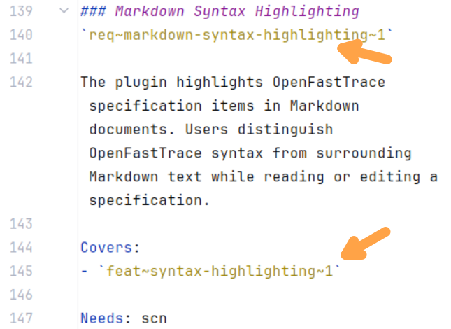
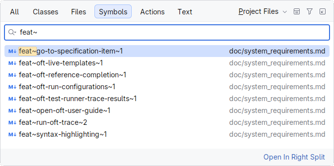
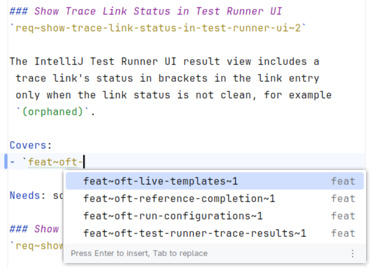
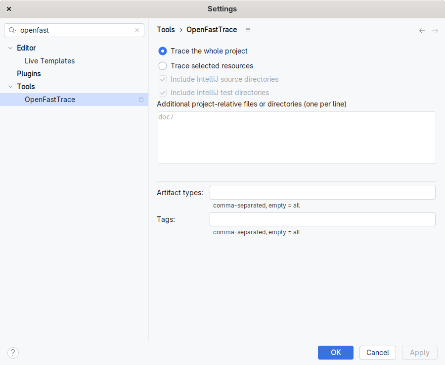
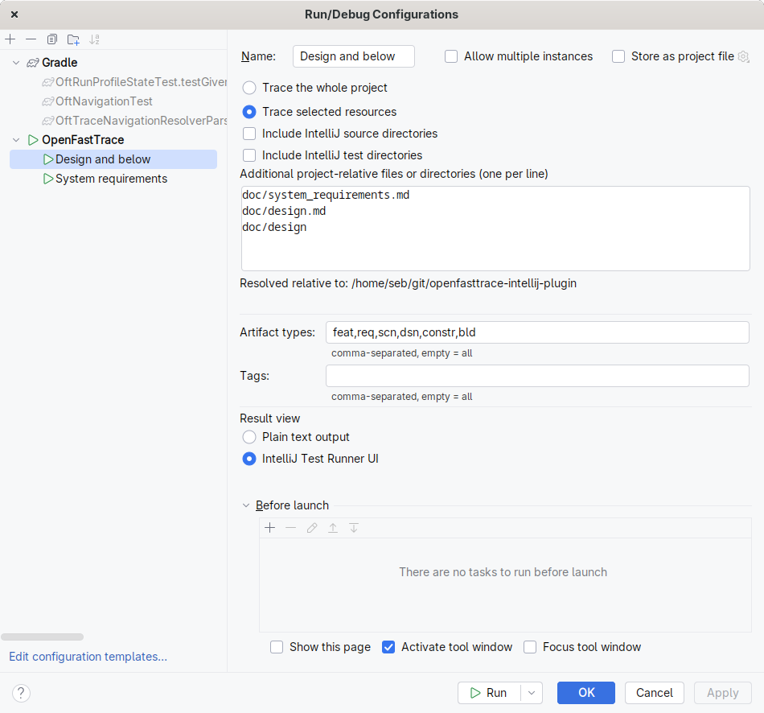
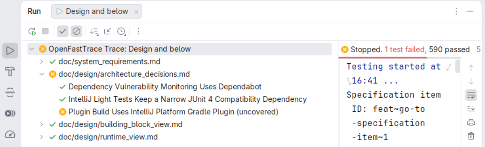
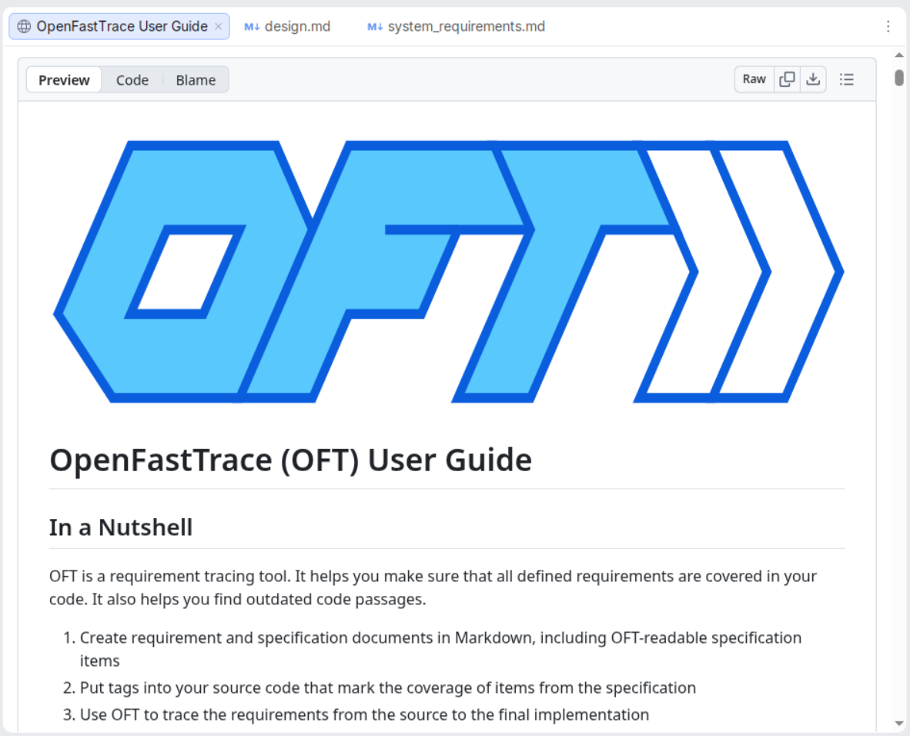

# OpenFastTrace IntelliJ Plugin User Guide

This guide explains how to install and use the OpenFastTrace IntelliJ plugin in a JetBrains IDE.

The plugin helps you author OpenFastTrace (OFT) documents, navigate between specification items and coverage links, and run OFT traces without leaving the IDE.

For the OFT syntax and tracing concepts themselves, see the [OpenFastTrace User Guide](https://github.com/itsallcode/openfasttrace/blob/main/doc/user_guide.md).

## Install The Plugin

### Install A Release Build

The plugin is distributed as a ZIP file on the repository's GitHub releases page:

<https://github.com/itsallcode/openfasttrace-intellij-plugin/releases/latest>

1. Open the latest release.
2. Download the plugin distribution ZIP from the release assets, for example `OpenFastTrace-<version>.zip`.
3. In the IDE, open `Settings | Plugins`.
4. Open the gear menu and choose `Install Plugin from Disk...`.
5. Select the downloaded plugin ZIP.
6. Confirm the installation and restart the IDE when prompted.

Use the plugin ZIP from the release assets. Do not install the GitHub-generated source-code ZIP.

Later versions will hopefully be available via the marketplace. For now manual installation and update is unfortunately still necessary.



### Run A Development Build

For local development or manual testing, clone this repository and launch a sandbox IDE:

```sh
./gradlew manualTestIde
```

The sandbox IDE starts with the locally built plugin installed.

## Open A Project

Open the project that contains your OFT specification documents and source files. The plugin works on the files in the opened IntelliJ project and uses the IDE index for search, navigation, and completion.

The checked-in demo project under [doc/demo/example](demo/example) is a small practice project. The guided walkthrough is in [doc/demo/plugin-demo.md](demo/plugin-demo.md).

## Recognize OFT Content

The plugin highlights OFT specification items in Markdown and reStructuredText specification files with these extensions:

* `.md`
* `.markdown`
* `.rst`

It also highlights OFT coverage tags in source, configuration, and markup files supported by the OpenFastTrace tag importer, for example Java, Kotlin, JavaScript, TypeScript, Python, shell scripts, JSON, YAML, TOML, SQL, Terraform, PlantUML, and Cucumber feature files.

OFT files remain ordinary project files. The plugin only adds editor support, navigation, completion, and trace execution.



## Find Specification Items

Use IntelliJ symbol search to find OFT specification item declarations across the project:

1. Invoke `Navigate | Symbol...` or use `Search Everywhere` and switch to the `Symbols` tab.
2. Type the full or partial OFT item ID.
3. Select the matching item.

The IDE opens the specification document at the item declaration.



## Navigate Between Items

Use `Go To Declaration` on OFT references to jump to the declaring specification item.

Supported navigation points include:

* an item ID under a `Covers:` entry in a supported specification document
* the left side of an OFT coverage tag in a supported source or configuration file
* the right side of an OFT coverage tag in a supported source or configuration file

When the caret is on an OFT item declaration, `Go To Declaration` stays on that declaration. Use `Go To Implementations` on the declaration to find covering occurrences such as `Covers:` entries and source-side coverage tags.

## Author Specification Items With Live Templates

The plugin bundles an `OpenFastTrace` live-template group under `Settings | Editor | Live Templates`.

Use a template by typing its abbreviation in a supported editor context and pressing `Tab`.

Common template abbreviations include:

* `feat` for a feature
* `req` for a requirement
* `scn` for a scenario
* `dsn` for a design item
* `arch` for an architecture item
* `constr` for a technical constraint

The `scn` template inserts a Given-When-Then scenario skeleton. Templates with a covered-item field can use completion while the caret is still inside that field.

## Complete OFT References

Use basic completion while editing a `Covers:` entry to select an existing specification item ID from the project index.



Completion also works on the target side of a likely OFT coverage tag after the left-hand artifact type and arrow. For example, in a supported source file, start the tag and invoke completion after the arrow.

<!-- oft:off -->

```text
[impl->]
```

<!-- oft:on -->

The completion list is based on declarations already present in the opened project. If the expected item is missing from completion, first verify that the item is declared in a supported specification file and that IntelliJ indexing has finished.


## Run A Project Trace

Run a project trace from the main menu:

1. Open `Tools | OpenFastTrace`.
2. Select `Trace Project`.

The default keyboard shortcut is `Ctrl+Alt+Shift+O`.

By default, the action traces the whole opened project and displays results in the IntelliJ Test Runner UI.

## Configure The Trace Project Action

Open `Settings | Tools | OpenFastTrace` to configure the global `Trace Project` action.



Choose one trace scope:

* `Trace the whole project` scans the opened project root.
* `Trace selected resources` scans only the selected source directories, test directories, and additional paths.

For selected-resource traces, configure these inputs:

* `Include IntelliJ source directories`
* `Include IntelliJ test directories`
* `Additional project-relative files or directories (one per line)`

The default additional path is `doc/`. Paths are resolved relative to the opened project root. The settings page validates the entered paths and shows the base directory used for resolution.

Use `Artifact types:` to limit a trace to comma-separated artifact types such as `feat,req,scn,dsn`.

Use `Tags:` to limit a trace to comma-separated OFT tags.

Leave `Artifact types:` or `Tags:` empty to include all artifact types or tags.

## Create OpenFastTrace Run Configurations

Use OpenFastTrace run configurations when you need multiple repeatable trace setups.

1. Open the run/debug configuration menu.
2. Choose `Edit Configurations...`.
3. Add a new `OpenFastTrace` configuration.
4. Configure the trace scope, artifact types, tags, and result view.
5. Save and run the configuration from the IDE toolbar.

Run configurations use the same trace-scope controls as `Settings | Tools | OpenFastTrace`.

They also let you choose the result view:

* `IntelliJ Test Runner UI` shows a structured result tree.
* `Plain text output` shows the rendered OFT report in an IDE output tab with ANSI colors preserved.

Use run configurations for recurring workflows such as tracing only a subsystem, tracing only requirement and design layers, or tracing a document set with a specific tag.



## Read Trace Results

The default Test Runner UI groups trace results by source file, specification item, and trace link.

Use it to:

* see whether the trace passed or failed
* expand failed files and specification items
* inspect incoming and outgoing trace links
* read defect explanations in the details panel
* navigate from result nodes back to source files, specification declarations, and source-side coverage tags

Clean items are shown as passed tests. Trace defects are shown as failed tests. The top-level trace result is marked failed when OFT reports trace defects.

Plain text output is useful when you want the raw OFT report. Specification item IDs in the plain text output are clickable when the plugin can resolve them to project files.



## Open The OpenFastTrace User Guide

Use `Help | OpenFastTrace User Guide` to open the upstream OpenFastTrace user guide in an integrated IDE browser tab.

Use that guide when you need details about OFT syntax, trace reports, importers, coverage tags, and command-line tracing outside the IntelliJ plugin.



## Troubleshooting

### No Specification Items Appear In Symbol Search

Check that the item is declared in a supported specification file extension: `.md`, `.markdown`, or `.rst`.

Wait for IntelliJ indexing to finish. Symbol search and completion depend on the project index.

### Navigation Does Not Jump To The Expected Item

Check the item ID spelling, artifact type, name, and revision. OFT revisions are part of the ID, so `req~example~1` and `req~example~2` are different items.

Check that the declaration exists in the opened project, not only in another checkout or a generated report.

### Completion Does Not Suggest The Expected ID

Verify that the target item is already declared in a supported specification file.

For coverage-tag completion, invoke completion on the target side after the arrow in a supported source or configuration file.

### Trace Project Scans Too Much Or Too Little

Open `Settings | Tools | OpenFastTrace` and switch between `Trace the whole project` and `Trace selected resources`.

For selected resources, verify the source-root checkboxes and the `Additional project-relative files or directories (one per line)` field. The field accepts one file or directory per line.

### The Trace Is Red After Adding Documentation Examples

If documentation contains illustrative OFT items or coverage tags that should not become part of the real trace, exclude those examples with OFT parser control comments named `oft:off` and `oft:on`.

Keep real product requirements, design items, implementation tags, and tests outside excluded example blocks so OFT can continue tracing them.

## Practice The Workflow

For a guided live demonstration, use [doc/demo/plugin-demo.md](demo/plugin-demo.md) with the isolated example project in [doc/demo/example](demo/example).

The demo walks through syntax highlighting, symbol search, live templates, completion, navigation, red and green trace results, source-side coverage tags, and the Help-menu guide action.
